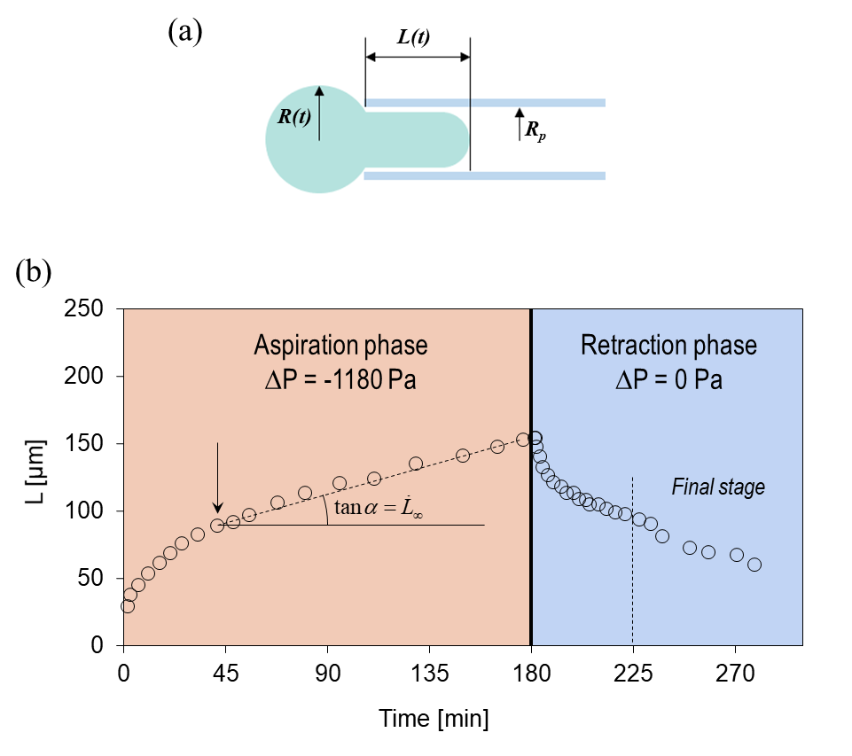
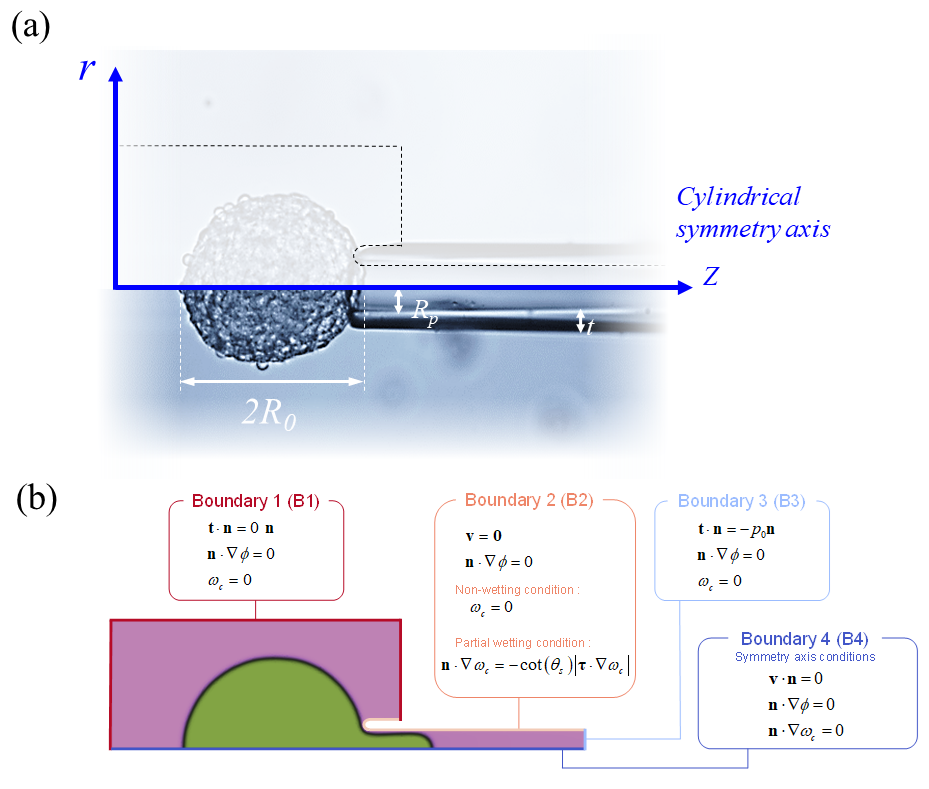

# Cahn-Hilliard-Navier-Stokes
This repository contains the code for the mathematical model presented in the paper: ['A Bi-Component Model to Assess the Rheology of Soft Cellular Aggregates Probed Using the Micropipette Aspiration Technique'](https://papers.ssrn.com/sol3/papers.cfm?abstract_id=4816238)

_Abstract_. The micro-pipette aspiration technique is a classical experiment used to characterize the physical properties of inert fluids and biological soft materials such as cellular aggregates. The physical parameters of the fluid, as viscosity and interfacial tension, are obtained by studying how the fluid enters the pipette when the suction pressure is increased and how it relaxes when the suction pressure is put to zero. A mathematical model representative of the experiment is needed to extrapolate the physical parameters of the fluid-like matter; however, for biological materials as cells or cell aggregates these models are always based on strong starting hypotheses that impact the significance of the identified parameters. In this article, starting from the bi-constituent nature of the cell aggregate, we derive a general mathematical model based of a Cahn-Hilliard-Navier-Stokes set of equations. The model is applied to describe quantitatively the aspiration-retraction dynamics of a cell-aggregate into and out of a pipette. We demonstrate the predictive capability of the model and highlight the impact of the assumptions made on the identified parameters by studying two cases: one with a non-wetting condition between the cells and the wall of the pipette (classical assumption in the literature) and the second one, which is more realistic, with a partial wetting condition (contact angle θs = 150°). Furthermore, our results provide a purely physical explanation to the asymmetry between the aspiration and retraction responses which is alternative to the proposed hypothesis of an mechano-responsive alteration of the surface tension of the cell aggregate.

## Archive organization
* _Experimental data_ contains the excel file with the data about the aspiration and retraction phase of the micropipette aspiration experiment;
* _Images_ contains two of the images of the reference article; 
* _Fenics_ contains the codes used for non-wetting and partially-wetting cases including the final set of parameters identified.

## Version
The numerical simulations have been performed using the legacy FEniCS environnement which has been installed following the instructions available in the [FEniCS website](https://fenicsproject.org/download/)

## Experiment

  

_Figure 1_ - (a) Geometrical description of the MPA test; (b) Experimental results for the aspiration and retraction phases of the modeled case.

This numerical study is based on the experimental results published by [Guevorkian _et al._(2010)](https://journals.aps.org/prl/abstract/10.1103/PhysRevLett.104.218101). In this paper the authors propose the use of the MPA technique to study the surface tension and mechanical properties of cell aggregates. Due to its viscoelastic properties when the cell aggregate is aspirated, it initially responds as an elastic solid, then as a viscous fluid at times larger than a certain characteristic time of about few tens of min. The micropipette has been chemically treated to limit the adhesion of cells to the internal wall of the pipette, leading to the assumption of a 180° contact angle. During the experiment, the aspiration of the aggregate in the pipette of radius Rp was monitored by tracking the position L(t) of the end of the tongue (Figure 1.a). In the example presented in Figure 1.a, Rp = 35 µm while the initial radius of the cells aggregate (just before aspiration) is R(0) = 175 µm. A suction pressure ∆p = −1180 Pa has been applied within the pipette during 180 minutes to aspirate the aggregate and monitor the advancement of the tongue; then the pressure ∆p has been set to zero which leads the retraction of the aggregate. During the aspiration phase after a fast initial deformation (elastic phase) the advancement of the front reaches a quite constant velocity as shown in Figure 1.b. The behavior is similar in the initial stage of the retraction phase; then in the final stage of the retraction the behavior slightly evolves (see data points in Figure 1.b after 225 min). 

## Mathematical model
In our mathematical framework we model the cell aggregate as a solution to account for its bi-constituent nature (_i.e._ cells + medium in the cell-cell interstitium). The model is developed within the frame of a Cahn-Hilliard-Navier-Stokes formulation which allows us to consider both effects related to cell-cell adhesion energy and to the intrinsic cell aggregate visco-elasticity by means of an Oldroyd-B rheological model. The proposed model is an extended version of the one some of us have already developed for modeling confined growth of encapsulated spheroids in [Le Maout et al. (2020)](https://www.science.org/doi/10.1126/sciadv.aaz7130). Here, by releasing the hypothesis of a negligible convective velocity of the solution, the momentum conservation equation of the solution does not reduce to the hydro-static case. Consequently, the Cahn-Hilliard system of equations must be solved in a coupled fashion with Navier-Stokes equations. 
We report below the final system of governing equations. For details about all the variables and on the derivation of this set of Partial Differential Equations (PDEs) please refer to the reference [paper](https://papers.ssrn.com/sol3/papers.cfm?abstract_id=4816238).

$$ \\frac{{\partial {\omega _c}}}{{\partial t}} + \nabla  \cdot \left( {{\omega _c}{\bf{v}}} \right) - \nabla  \cdot \left( {M\nabla \phi } \right) = 0\ $$ 

$$ \\phi  = \frac{{\alpha \sigma }}{\varepsilon }f'\left( {{\omega _c}} \right) - \alpha \sigma \varepsilon \Delta {\omega _c}\ $$

$$ \\nabla  \cdot {\bf{v}} = 0\ $$

$$ \\rho \frac{{\partial {\bf{v}}}}{{\partial t}} = \nabla  \cdot \left\( { - p{\bf{1}} + \mu \left( {\nabla {\bf{v}} + {{\left( {\nabla {\bf{v}}} \right)}^T}} \right) + {{\bf{t}}_{VE}}} \right\) + \phi \nabla {\omega _c}\ $$

$$ \{{\bf{t}}_{VE}} + {\omega _c}{\lambda _{cm}}\left[ {\frac{{\partial {{\bf{t}}_{VE}}}}{{\partial t}} + {\bf{v}}\nabla {{\bf{t}}_{VE}} - {{\left( {\nabla {\bf{v}}} \right)}^{\rm{T}}}{{\bf{t}}_{VE}} - {{\bf{t}}_{VE}}\nabla {\bf{v}}} \right] = {\omega _c}{\mu _{cm}}\left[ {\nabla {\bf{v}} + {{\left( {\nabla {\bf{v}}} \right)}^{\rm{T}}}} \right] $$

## Geometry and boundary conditions

  

To reduce the computational cost of the numerical simulations we have exploited the cylindrical symmetry of the problem (Figure 3.a). The boundary conditions for NS and CH equations are depicted in Figure 3.b. 

For the NS system, we have four types of boundary conditions for the four bounds B1, B2, B3 and B4:
*	on B1 a normal stress equal to 0 Pa is set;
*	on B2 which corresponds to the surface of the pipette the velocity vector is set null (no-slip condition);
*	on B3 which corresponds to the right extremity of the pipette we set the suction pressure (p0 = 1180 Pa which corresponds to that applied experimentally) during 180 minutes (aspiration phase) then we set p0 = 0 Pa (retraction phase);
*	on B4 the axial-symmetry of the problem is accounted by setting the velocity component vr = 0;
For the CH system we shall distinguish the boundary conditions for the two cases, i.e. the non-wetting and the partial wetting case.

For the non-wetting case:
*	on the boundary B1 U B2 U B3 a natural condition is assumed for the chemical potential while a non-wetting condition is assumed for the mass fraction of cells;
*	on B4 the boundary condition respects the axial-symmetry of the problem [natural conditions (null normal gradient) are assumed for both the chemical potential and the mass fraction of cells];
For the partial wetting case:
*	the conditions are the same as for the non-wetting case with exception on the surface of the pipette (B2) where a condition of partial wetting is applied.

The cell aggregate is initially outside the pipette. Then, thanks to the suction pressure applied on B3, it starts to be aspirated during 180 minutes. After 180 minutes the pressure on B3 is set null so the aggregate starts to retract until it fully exits the pipette. 

## References

* K Guevorkian, MJ Colbert, M Durth, S Dufour, F Brochard-Wyart (2010) Aspiration of biological viscoelastic drops. Phys. Rev. Lett. 104, 218101.
* V Le Maout, K Alessandri, B Gurchenkov, H Bertin, P Nassoy, G Sciumè (2020) Role of mechanical cues and hypoxia on the growth of tumor cells in strong and weak confinement: A dual in vitro–in silico approach. Sci. Adv. 6, eaaz7130.
* G Sciumè, K Guevorkian, P Nassoy (2024) A bi-component model to assess the rheology of soft cellular aggregates probed using the micropipette aspiration technique. _under review_

